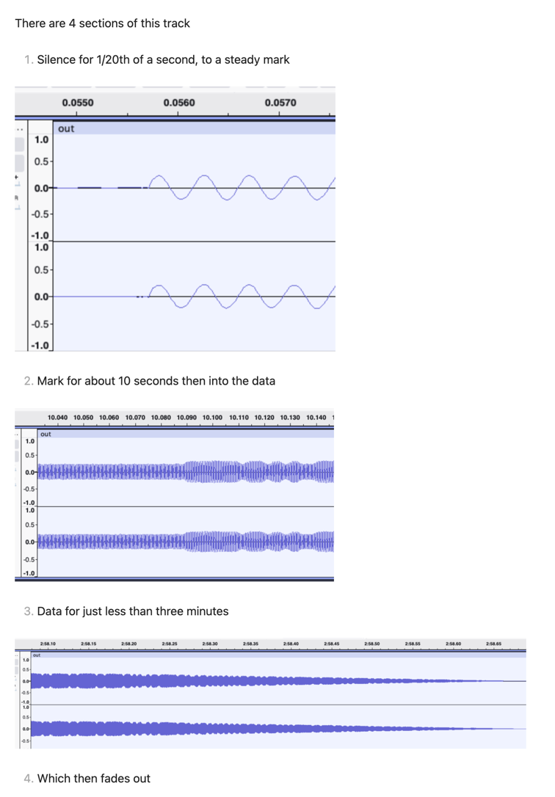

# CS516 - Project 2 - Modem output

Ed Norris - Spring 2026

### Description
Given simulated modem data recorded in a wav file (`message.wav`), determine the contents of the message.  This script expects the "answer" side of a 300 baud modem and that the data encodes ASCII text.


### Development
This is an ideal situation - no noise, there is no simultaneous outgoing transmission, and the frame window starts exactly at the beginning of the data.

The data is known to be the "answer" side of the communication so a bit is:
* one - "mark" - a 2225 Hz sine wave
* zero - "space" - a 2025 Hz sine wave

A byte is encoded as a space, 8 bits of data, then a mark.

So it is simply a matter of reading a bits worth of data, determining if it is zero or one, then validating and translating each collection of ten bits into an ASCII character.

### To run
Run with `uv` 

```commandline
uv run project2.py -f [wav file]
```

### Extra work

There is a particular song that is a message contained in a 300 baud modem recording.  Find it and decode it.

Title:       300BPS N, 8, 1 (Terminal Mode or ASCII Download)
Author:      Information Society - Topic
Duration:    2m59s

| ITAG | FPS | VIDEO QUALITY | AUDIO QUALITY | AUDIO CHANNELS | SIZE [MB] | BITRATE | MIMETYPE | LANGUAGE |
|------|-----|---------------|---------------|----------------|-----------|---------|----------|----------|
| 251 | 0 | | medium | 2 | 3.4 | 159769 | audio/webm; codecs="opus" | |
| 18 | 25 | 360p | low | 2 | 3.3 | 154455 | video/mp4; codecs="avc1.42001E, mp4a.40.2" | |
| 140 | 0 | | medium | 2 | 2.8 | 129633 | audio/mp4; codecs="mp4a.40.2" | |
| 137 | 25 | 1080p | | 0 | 2.5 | 118574 | video/mp4; codecs="avc1.640020" | |
| 136 | 25 | 720p | | 0 | 1.5 | 69352 | video/mp4; codecs="avc1.64001f" | |
| 249 | 0 | | low | 2 | 1.4 | 67083 | audio/webm; codecs="opus" | |
| 248 | 25 | 1080p | | 0 | 1.2 | 58543 | video/webm; codecs="vp9" | |
| 139 | 0 | | low | 2 | 1.0 | 48906 | audio/mp4; codecs="mp4a.40.5" | |
| 247 | 25 | 720p | | 0 | 0.9 | 41492 | video/webm; codecs="vp9" | |
| 135 | 25 | 480p | | 0 | 0.8 | 38701 | video/mp4; codecs="avc1.4d401e" | |
| 244 | 25 | 480p | | 0 | 0.6 | 26738 | video/webm; codecs="vp9" | |
| 134 | 25 | 360p | | 0 | 0.5 | 25741 | video/mp4; codecs="avc1.4d4015" | |
| 243 | 25 | 360p | | 0 | 0.5 | 21829 | video/webm; codecs="vp9" | |
| 133 | 25 | 240p | | 0 | 0.3 | 16238 | video/mp4; codecs="avc1.4d400c" | |
| 242 | 25 | 240p | | 0 | 0.3 | 16057 | video/webm; codecs="vp9" | |
| 278 | 25 | 144p | | 0 | 0.3 | 12694 | video/webm; codecs="vp9" | |
| 160 | 25 | 144p | | 0 | 0.2 | 10165 | video/mp4; codecs="avc1.4d400b" | |

`ffmpeg -i song.webm -c:a pcm_f32le song.wav`

```
$ file song.wav
song.wav: RIFF (little-endian) data, WAVE audio, IEEE Float, stereo 48000 Hz
```



So
1. Determine a threshold for a signal
2. Read the file, and once the threshold has been met, start converting each set of 160 samples into a bit
3. Move a sliding window along the bits and look for a zero followed by a one 9 bits away; that's the byte.
4. Extract the bytes and convert to ASCII

Mostly decoded correctly, although there is this section:
```commandline
USING SOME SPARE ELECTRONIC PARTS 
OÔ ÃO§:P=Ü WNS9 REAN ISLAND IN THE AMAZON, ØE WIRED THE ENTIRE BUS FR vEMEE 
         p n«X Xb;22Î< @Ʋ		2²9'2 ²'l $0É ˜1’?†É
                                                            ÈÍ9 a!9IÎT	%CÌLtIEs ÏÆ HR q9.
  "COWLDÎ'T yU SEE YU% WAY CLEAR TO LETTINC US FULFILL OUR CÏNTRACTUAL 
OBLIGATIONS IN CURITIBA? THINK OF THE KIDS!"
```

But I get the gist - it's a good story

To run this part:  (I use 10 as the minimum power level, YMMV)
```commandline
uv run project2.py -f [the wav file] -p [minimum power level]
```
